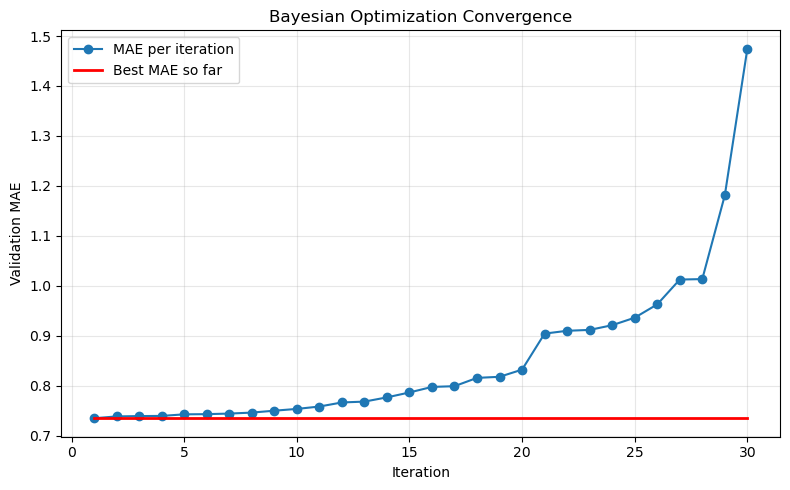
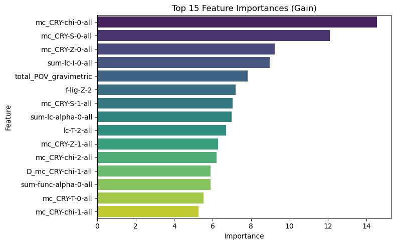

# MOFs: Machine Learning for Discovery of Metal–Organic Frameworks (MOFs) for Gas Separation Applications  
[](https://www.python.org/)  [](LICENSE)  [](https://xgboost.readthedocs.io/)  [](#)  

---

## 🧱 Overview  
Metal–Organic Frameworks (MOFs) are a class of **porous crystalline nanomaterials** with exceptional tunability, making them ideal for **carbon capture and gas separation** applications.  
By combining different **metal nodes** and **organic linkers**, the geometry and chemistry of MOFs can be customized to selectively adsorb certain gases (like CO₂) while allowing others to pass through.  

However, the vast design space — with nearly infinite linker–metal combinations — makes identifying optimal MOFs extremely challenging.  
**Machine Learning (ML)** accelerates this discovery process by learning relationships between **MOF descriptors** and **gas uptake properties**, enabling data-driven screening of materials without exhaustive experimentation.

<p align="center">
  
</p>

---

## 🎯 Main Goals  
- Perform **exploratory data analysis (EDA)** to identify meaningful structural and chemical descriptors.  
- Develop **regression models** to predict **CO₂ uptake** at low (0.15 bar) and high (16 bar) pressures.  
- Reduce feature dimensionality using **feature selection (RFECV)** to improve model interpretability and performance.  
- Optimize **XGBoost** hyperparameters using **Bayesian Optimization (BayesSearchCV)**.  

---

## 📊 Dataset  
Source: *“Understanding the diversity of the metal–organic framework ecosystem”* (dataset for gas adsorption property prediction).  

**Dataset Characteristics:**  
- ~5,000 MOFs  
- ~300 features (structural + chemical descriptors)  
- Four target properties:  
  - CO₂ uptake @ 0.15 bar, 298 K  
  - CO₂ uptake @ 16 bar, 298 K  
  - CH₄ uptake @ 5.8 bar, 298 K  
  - CH₄ uptake @ 65 bar, 298 K  

**Descriptors:**  
- **Geometric descriptors** (e.g., pore volume, density, Di, Df, Dif, surface area, probe-occupiable pore volume).  
- **Revised Autocorrelation Functions (RACs):** encode atomic-level chemistry via properties such as electronegativity (χ), connectivity (T), identity (I), covalent radii (S), and nuclear charge (Z).  

<p align="center">
  
</p>

---

## 🧠 Model of Choice — XGBoost  
**Why XGBoost?**  
- Proven performance on **tabular chemical data**  
- Handles **nonlinear and high-dimensional relationships** effectively  
- Fast and interpretable feature importance  
- Prone to overfitting if tree depth is too high → requires careful tuning  

**Baseline:**  
- Dataset split: 80/20 train-validation  
- Initial untuned model R² ≈ **0.67–0.68**

---

## ⚙️ ML Pipeline  

<p align="center">
  
</p>

---

## 🧩 Curse of Dimensionality  
- ~300 features, ~5,000 data points  
- Rule of thumb: need 10–20× more samples than features  
- Applied **Recursive Feature Elimination with Cross-Validation (RFECV, k=6)** → reduced to **59 key features**  
- Most important descriptors: **RACs** (chemical), supplemented by geometric features like **Di, Df, Dif**, and **density**  

---

## 🔍 Hyperparameter Optimization — BayesSearchCV  
**Why Bayesian Optimization?**  
- Efficiently approaches global optimum using a **Gaussian Process surrogate model**  
- Less computationally expensive than grid search  

**Search Space:**  
| Hyperparameter | Range / Type |
|-----------------|---------------|
| Learning rate | [0.01, 1.0] |
| Max depth | [3, 10] |
| Subsample | [0.1, 1.0] |
| Reg. λ (L2) | log-uniform [1e−6, 1000] |
| Reg. α (L1) | log-uniform [1e−6, 1000] |
| Estimators | 600 (fixed) |
| Objective | Negative MAE |

**Training subset:** 40% of data (for faster optimization)

---

## 📈 Results  

✅ **Best Bayesian Optimization Results:**  
- **Best MAE:** 0.7352  
- **Best parameters:**  
  ```python
  {
    'colsample_bytree': 0.3,
    'learning_rate': 0.094,
    'max_depth': 8,
    'reg_alpha': 1.0,
    'reg_lambda': 1e-6,
    'subsample': 1.0
  }

✅ **convergence of Bayesian Optimization (BO):**
<p align="center"> 

✅ **Based on the optimization, the 15 important parameters:**
<p align="center"> 
